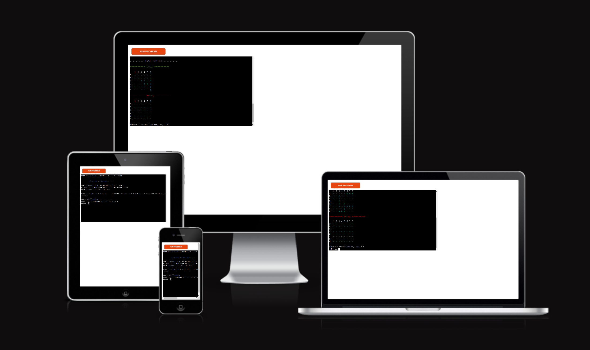
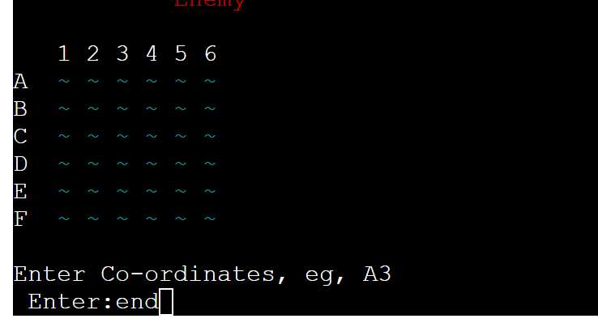
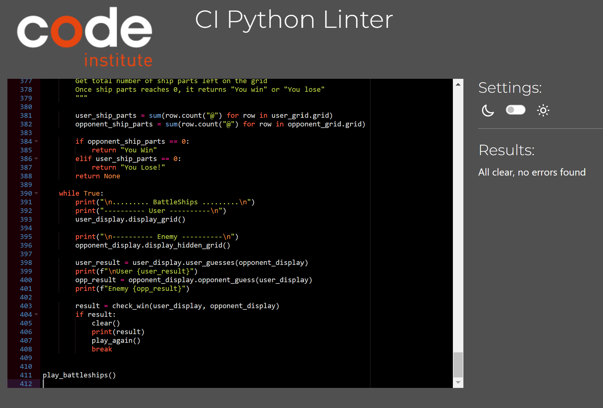

# BATTLESHIPS GAME

Welcome to the Battleships game. this is a command-line implementation of the classic Battleships board game
written in Python.
The goal is to find and destroy all enemy ships before they destroy your.

 

[Click here](https://battleship--game-308a1679c9d6.herokuapp.com/) to see deployed game.

## Table of Contents
- [Game Rules](#game-rules)
- [Ship Types](#ship-types)
- [Features](#features)
- [Data Model](#data-model)
- [Difficulty Levels](#difficulty-levels)
- [Dependencies](#dependencies)
- [How To Play](#how-to-play)
- [Deployment](#deployment)
- [Testing and Validating](#testing-and-validating)
- [References](#references)

## Game Rules
1. The game is played on a grid where each player has a fleet of ships.

2. Players take turns guessing the co-ordinates of the enemy's ships.

3. A Hit is marked with "X" and a Miss is marked with "o"

4. The game continues until all parts of the player or enemys ships
has been destroyed.

## Ship Types
| Ships      | Size |
| ---------- | ---- |
| Carrier    | 5    |
| Battleship | 4    |
| Cruiser    | 3    |
| Submarine  | 2    |
| Destroyer  | 2    |
## Features
- Three difficulties: Easy, Medium, Hard.

- Grids are varying sizes depending on game difficulty

- Hidden ships on opponent grid adds to the challenge

    

-  Exit game by entering "END", takes you back to difficulty selection

    

## Data Model
- I used a Board class as the main model with 'Usergrid' and
'OpponentGrid' as subclasses. 

- This allows both to use the same grid setup but have different actions without effecting the main model.

- The 'Ship' class keeps details and placement rules clear and reusable.

## Difficulty Levels
**EASY :** 3 Ships, 6x6 grid.

**MEDIUM :** 5 Ships, 8x8 grid

**HARD :** 5 Ships, 10x10 grid

## Dependencies
- Python 3

- [Colorama](https://pypi.org/project/colorama/) was used to give the game color.

## How To Play
1. Choose the difficulty level you wish to play.
    [Difficulty selection](assets/images/choose-difficulty.png)

2. The game will display 2 grids: one for the user and one for the opponent

3. Enter you guess in the format: A1, B3, C3 etc..
    - [co-ordinate input](assets/images/choose-coordinates.png)

    Invalid input displays the following:
    - [invalid input format](assets/images/invalid-coordinate-format.png)
    - [input exceeds grid size](assets/images/Invalid-coordinates-alert.png)

4. The game will inform you if your guess is a "HIT" or a "MISS" and mark it on the grids.

- [HIT or Miss](assets/images/Hit-or-miss.png)

5. The opponent will also make a guess

6. Continue guessing until all the opponent ships have been destroyed.

    Results are displayed at end of game either if u win or lose and a play again input will follow.
    - [End-game Win](assets/images/result-display-win.png)
    - [End-game Lose](assets/images/result-display-lose.png)

## Deployment
This game has been deloyed using Heruko.
The link to the game is at the start of the Readme.

### Local Development

#### How to Fork

To fork the repository:

1. Log in (or sign up) to Github.

2. Go to the repository for this project, brandonn3lson/battleships.

3. Click the Fork button in the top right corner.

#### How to Clone

1. Find the repository for this project, battleships

2. **Get the Clone URL** Click on the green "Code" button and copy the URL that appears.

3. Open Terminal or Command Prompt: Open the Terminal (Mac/Linux) or Command Prompt (Windows).

4. Navigate to the Directory: Use the cd command to go to the folder where you want to put the cloned repository.

5. Clone the Repository: Type git clone, paste the URL you copied, and press Enter.

6. Wait for it to Finish: It might take a moment. Once it's done, you'll see a message.

7. Done!: You now have a copy of the repository on your computer.

## Testing and Validating

- [Code Institute Python Linter](https://pep8ci.herokuapp.com/#)

- 

## Manual testing
    
| Test Case                                 | Description                               | Expected Result                                                  | Status |
| ----------------------------------------- | ----------------------------------------- | ---------------------------------------------------------------- | ------ |
| Start Game                                | Run python battleships.py                 | Game starts and displays welcome message and difficulty options  | Pass   |
| Choose Easy Difficulty                    | Input 'E' when prompted for difficulty    | 6x6 grid is displayed with 3 ships for both user and opponent    | Pass   |
| Choose Medium Difficulty                  | Input 'M' when prompted for difficulty    | 8x8 grid is displayed with 5 ships for both user and opponent    | Pass   |
| Choose Hard Difficulty                    | Input 'H' when prompted for difficulty    | 10x10 grid is displayed with 5 ships for both user and opponent  | Pass   |
| Enter invalid Difficulty choice           | Input 'F', '\*!',                         | Game displays an error message and prompts to choose difficulty. | Pass   |
| Enter Valid Guess                         | Input 'A1', 'B2', etc.                    | Game processes the guess and updates the grid accordingly        | Pass   |
| Enter empty guesses, and with whitespaces | Input: "    "                             | Game displays an error message and prompts for a new guess       | pass   |
| Enter Invalid Guess                       | Input 'Z9', '1A', etc.                    | Game displays an error message and prompts for a new guess       | Pass   |
| Hit Ship                                  | Guess a coordinate with a ship part       | Grid updates with an 'X' and displays "HIT!"                     | Pass   |
| Miss Ship                                 | Guess a coordinate without a ship part    | Grid updates with an 'o' and displays "MISSED"                   | Pass   |
| End Game Early                            | Input 'END' when prompted for coordinates | Game ends and returns to difficulty selection                    | Pass   |
| Win Game                                  | Sink all opponent ships                   | Game displays "You Win"                                          | Pass   |
| Lose Game                                 | Opponent sinks all user ships             | Game displays "You Lose!"                                        | Pass   |
| Play Again Yes                            | Input 'Y' when prompted to play again     | Game restarts and prompts for difficulty selection               | Pass   |
| Play Again No                             | Input 'N' when prompted to play again     | Game ends with a thank you message                               | Pass   |

## References

- [Clear_screen](https://www.geeksforgeeks.org/clear-screen-python/) function was taken
   from the geekforgeeks.org website, to clear screen at the en of the game.

- [Python slicing](https://www.pythoncheatsheet.org/builtin/slice) to show me how to use slice function.

- [freecoderscamp.ord](https://www.freecodecamp.org/news/if-name-main-python-example/)

- [Stack Overflow](https://stackoverflow.com/questions/67308698/how-to-make-a-nested-list-comprehension) : Nested for loops to make the grids.

- [markdown table coverter](https://tabletomarkdown.com/convert-spreadsheet-to-markdown/) used for converting excel sheet for manual testing table to markdown.

[Back to top](#battleships-game)